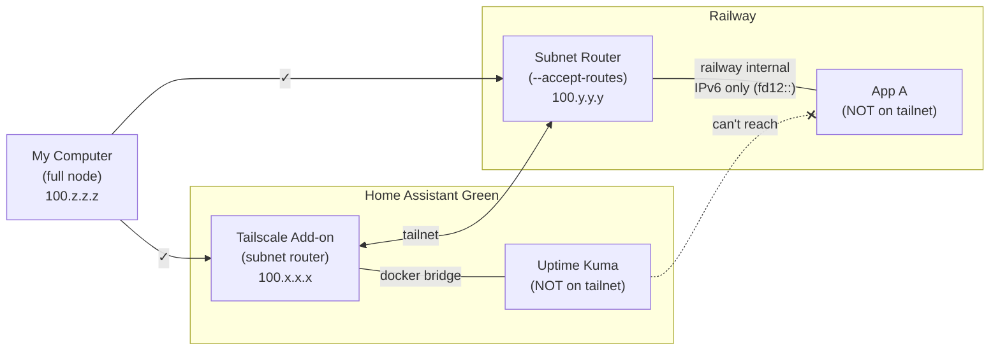

# Tailscale Subnet Router Networking: Why Containers Can't Talk to Each Other

## The Setup

My computer (full Tailscale node) can reach both HA and Railway.
But HA's Uptime Kuma and Railway's apps cannot reach each other,
even by Tailscale IP or MagicDNS.

## What Works

**My computer → HA stuff:** Works. Full Tailscale client handles
routing and DNS automatically.

**My computer → Railway stuff:** Works. Same mechanism. Split DNS
resolves `*.railway.internal`.

## What Doesn't Work

**HA Uptime Kuma → Railway:** Broken.
**Railway App → HA:** Broken.

Neither direction works because containers behind subnet routers
are not on the tailnet — they're merely reachable FROM the tailnet.

## Why It's Broken

A **subnet router** lets tailnet nodes reach in to a local network.
It does NOT let sibling containers reach out to the tailnet.

My computer works because the Tailscale daemon automatically:

1. Adds OS-level routes: "send `100.64.0.0/10` through `tailscale0`"
2. Intercepts DNS: resolves MagicDNS and split DNS domains

Containers behind subnet routers have neither.

**Subnet routers are inbound-only gateways.**

## What We Tried (April 2026)

### `userspace_networking: false` on HA Tailscale add-on

**Result: Partial success, ultimately a dead end.**

- Setting `userspace_networking: false` DID allow pinging the
  Railway subnet router's Tailscale IP (`100.76.68.37`) from the
  HA terminal. So IPv4 Tailscale IP routing worked.
- BUT: Railway's internal network is **IPv6-only** (`fd12::`).
  Pinging any `fd12::` address returned "Network unreachable".
  The accepted IPv6 subnet routes were never installed in the
  host routing table.
- HA Green lacks kernel WireGuard support — even with the setting
  off, logs showed "configuring userspace WireGuard config".
  Userspace WireGuard handles Tailscale IPs internally but does
  not install IPv6 subnet routes into the host.
- Additionally, this setting caused a **DNS loop**: the
  `homeassistant` split DNS entry pointed to HA's own Tailscale IP
  (`100.116.3.8`), causing DNS queries to loop to itself and
  saturate at 150 concurrent queries. Removing the `homeassistant`
  split DNS entry from the Tailscale admin console would fix the
  loop, but the IPv6 routing issue remains.
- **Reverted to `userspace_networking: true`.**

### Why this is a dead end for HA Green + Railway specifically

The combination of:

1. HA Green lacking kernel WireGuard (no real `tailscale0` routes)
2. Railway using IPv6-only internal networking (`fd12::`)
3. No host-level shell access on HA Green to manually add routes

...means the HA Tailscale add-on cannot route IPv6 accepted subnet
traffic for other add-on containers. Even if IPv4 worked, there's
no IPv4 path into Railway's internal network.

## What Would Actually Fix It

### Option A: Run Tailscale in the containers that need it

Install the Tailscale client directly in the Railway Uptime Kuma
container and/or the HA Uptime Kuma add-on. Makes them full tailnet
nodes. Works but breaks the clean subnet router pattern and adds
operational complexity.

### Option B: Use an external monitoring approach

Instead of having the two Uptime Kuma instances monitor each other
directly, use a third monitoring point (e.g., my computer, or a
VPS with Tailscale) that can reach both sides, since it's a full
tailnet node.

### Option C: Wait for improvements

The HA Tailscale add-on or Tailscale itself may eventually support
proper gateway mode for containerized environments, or Railway may
add IPv4 internal networking.

## TL;DR

Subnet routers let the tailnet reach **in**. They don't let
sibling containers reach **out**. My computer can reach both
sides because it runs a full Tailscale client. The containers
don't, so they can't. On HA Green specifically, even
`userspace_networking: false` can't fix IPv6 subnet routing
because there's no kernel WireGuard support.
