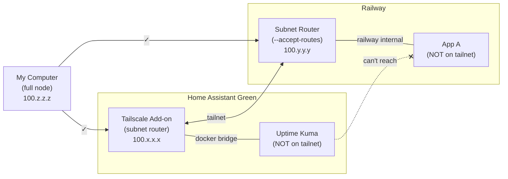

# Tailscale Subnet Router Networking: Why Containers Can't Talk to Each Other

## The Setup

My computer (full Tailscale node) can reach both HA and Railway.
But HA's Uptime Kuma and Railway's apps cannot reach each other,
even by Tailscale IP or MagicDNS.

## What Works

**My computer → HA stuff:** Works. My computer is a full tailnet
node. The Tailscale daemon adds routes for HA's advertised subnet
and handles DNS. Traffic goes through the tailnet to the HA
Tailscale add-on, which forwards it across the Docker bridge to
Uptime Kuma.

**My computer → Railway stuff:** Works. Same mechanism. Tailscale
daemon routes traffic to Railway's subnet router, which forwards
to sibling containers. Split DNS resolves `*.railway.internal`.

## What Doesn't Work

**HA Uptime Kuma → Railway (or any tailnet IP):** Broken.
Uptime Kuma is a separate container. It has no route to
`100.64.0.0/10`. Its default gateway is HA's regular network
stack (home router), which doesn't know tailnet IPs. DNS also
fails: it uses HA's resolver, not MagicDNS.

**Railway App → HA (or any tailnet IP):** Broken. Same problem,
other direction. Railway containers route through Railway's
default gateway and use Railway's DNS.

## Why It's Broken

A **subnet router** does two things:

1. Advertises a local subnet to the tailnet (lets tailnet nodes reach in)
2. Optionally accepts other nodes' routes (`--accept-routes`)

It does **NOT**:

- Act as a gateway for sibling containers' outbound traffic
- Inject routes or DNS config into sibling containers

My computer works because the Tailscale daemon running on it
automatically:

1. Adds OS-level routes: "send `100.64.0.0/10` through `tailscale0`"
2. Intercepts DNS: resolves MagicDNS names and split DNS domains

The containers behind each subnet router have neither. They are
not on the tailnet. They are merely _reachable from_ the tailnet.

**Subnet routers are inbound-only gateways by default.**

## What Would Fix It

### Option A: Make the subnet router a real gateway

Tell sibling containers to route `100.64.0.0/10` through the
subnet router's local IP, and use it for tailnet DNS. Requires
control over container networking, which Railway and HA Green
don't expose.

### Option B: Run Tailscale in the containers that need it

Install the Tailscale client directly in the containers that
need cross-site access. Makes them full tailnet nodes. Works
but breaks the clean subnet router pattern.

### Option C: `userspace_networking: false` (HA side only)

The community HA Tailscale add-on has a `userspace_networking`
option. When set to `false`, it creates a `tailscale0` interface
on the host and enables bidirectional communication, MagicDNS
proxies, and network forwarding — potentially allowing other
add-ons to route through it. Only solves the HA side.

## TL;DR

Subnet routers let the tailnet reach **in**. They don't let
sibling containers reach **out**. My computer can reach both
sides because it runs a full Tailscale client. The containers
don't, so they can't.
